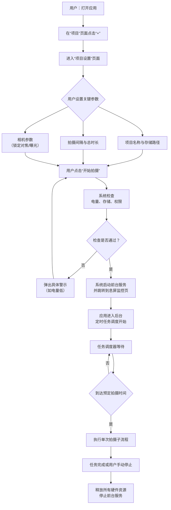

# **息屏延时摄影工具“ChronoSnap”产品需求文档**

## **1. 文档概述**

### **1.1 产品名称**
ChronoSnap（中文名：时影）

### **1.2 文档目标**
本文档旨在为开发一款用于**星轨、植物生长记录等专业延时摄影场景**的Android应用提供精确、完整的产品定义和技术指导。该应用的核心是在手机**完全息屏状态下，实现稳定、可靠、低功耗的长期自动定时拍照**，并将照片序列高效归档，便于导入电脑进行后期堆栈处理。

### **1.3 产品定位与目标用户**
*   **定位**：填补市场空白，成为**严肃摄影爱好者、自然观察者、科研记录人员**的首选专业延时摄影采集工具。
*   **核心差异**：与“iVCam”等无线摄像头软件不同，本产品是**独立、离线运行的后台自动化工具**，不依赖电脑实时连接，专注于**单设备、长时间、预设任务的可靠执行**。

### **1.4 需求背景与市场缺口**
根据调研，现有方案（如将手机设为无线摄像头并用电脑软件录制）存在**必须保持电脑开机、无法在手机端预设复杂任务、流程繁琐**等致命缺陷。用户需要一个能设定好任务后即可“放任不管”的可靠工具。

---

## **2. 产品核心目标**

1.  **可靠的后台执行**：确保应用在手机息屏、锁屏甚至轻度清理后台后，仍能精准执行定时拍摄任务。
2.  **极致的功耗控制**：通过精细化的硬件调用策略，最大化单次充电的拍摄时长。
3.  **严格的拍摄纪律**：确保每次拍摄的照片在曝光、对焦参数上保持一致，为后期堆栈奠定基础。
4.  **有序的数据管理**：自动为每次任务创建清晰的文件结构，方便后期查找与处理。

---

## **3. 详细功能规格**

### **3.1 功能模块总览**
| 模块 | 功能点 | 优先级 | 说明 |
| :--- | :--- | :--- | :--- |
| **项目管理** | 创建/编辑/删除项目 | P0 | 任务管理的基本单元 |
|  | 项目设置（名称、存储路径） | P0 | |
| **拍摄计划** | 设置拍摄间隔（秒/分/时/日） | P0 | 核心功能 |
|  | 设置拍摄总数/持续时间 | P0 | 两种终止条件 |
|  | 高级时间表（如仅在日间拍摄） | P1 | |
| **相机控制** | 分辨率与画质选择 | P0 | |
|  | 手动对焦锁定 | P0 | **关键功能**，保证焦点一致 |
|  | 手动曝光锁定/固定ISO、快门 | P1 | **关键功能**，保证曝光一致 |
|  | 关闭自动白平衡 | P1 | 保证色彩一致 |
| **监控与维护**| 息屏前台通知（电量、进度、下次拍摄） | P0 | 主要用户交互接口 |
|  | 任务运行日志查看 | P1 | 用于排错 |
| **导出与分享**| 按项目打包照片序列（ZIP） | P0 | 便于传输到电脑 |
|  | 生成简单的延时预览视频 | P2 | 用于快速检查效果 |

### **3.2 核心用户流程与逻辑**

#### **3.2.1 主要流程：创建并执行一个延时任务**


#### **3.2.2 子流程：单次拍摄执行细节**
1.  **唤醒与初始化**：由`WorkManager`或`AlarmManager`唤醒应用进程。**极速初始化相机**，加载预设的锁定参数（对焦距离、曝光值）。
2.  **拍摄**：执行无声拍照，保存图像为`项目名/YYYY-MM-DD_HH-MM-SS_序列号.jpg`格式。
3.  **元数据写入**：在照片`EXIF`信息中，额外写入`ChronoSnap_ProjectName`、`ChronoSnap_ShotIndex`等自定义字段。
4.  **清理与休眠**：立即释放相机资源，更新下一次任务的时间，让进程进入休眠。

### **3.3 后台服务与保活策略（Android实现核心）**
这是产品能否成功的**技术基石**，需采用分层策略：

| 策略层级 | 具体实现 | 目的 |
| :--- | :--- | :--- |
| **1. 前台服务** | 常驻通知栏，显示下次拍摄时间、已完成张数、电量。 | 提升进程优先级，防止被系统轻易杀死。 |
| **2. 精确调度** | 使用`AlarmManager.setExactAndAllowWhileIdle()`或`WorkManager`的精确周期任务。 | 保证在Doze模式下仍能准时唤醒。 |
| **3. 引导用户** | 任务开始前，图文引导用户关闭本应用的“电池优化”。提供一键跳转设置。 | 应对各厂商（小米、华为等）的后台限制。 |
| **4. WakeLock** | 仅在使用相机时持有一个`PARTIAL_WAKE_LOCK`，拍摄完成后立即释放。 | 防止CPU休眠导致拍摄失败，同时避免不必要的耗电。 |

---

## **4. 数据与文件结构**

### **4.1 本地数据库表（Room）**
*   **Project表**：`id`, `name`, `storage_path`, `interval_seconds`, `total_shots`, `created_time`, `camera_config_json` (存储锁定的焦点、曝光等参数)。
*   **ShotLog表**：`id`, `project_id`, `file_path`, `timestamp`, `battery_level`, `is_success`。

### **4.2 文件系统结构**
```
内部存储/Pictures/ChronoSnap/
├── Project_A_20240415/          # 项目文件夹，以“项目名_创建日期”命名
│   ├── config.json              # 项目设置的备份
│   ├── shot_log.csv             # 拍摄日志的易读版本
│   └── IMAGES/                  # 所有照片存放于此
│       ├── Project_A_20240415_173000_001.jpg
│       └── Project_A_20240415_173005_002.jpg
└── Project_B_20240420/
    └── ...
```

---

## **5. 非功能性需求**

*   **可靠性**：在99%的情况下，能准确执行预设时间表，误差小于10秒。
*   **功耗**：在屏幕关闭、仅维持后台调度的情况下，每小时额外耗电应小于3%（视拍摄间隔而定）。连续拍摄12小时，总耗电不超过40%。
*   **兼容性**：支持Android 10 (API 29) 及以上版本。适配不同厂商（小米、OPPO、vivo、华为）的后台管理机制。
*   **稳定性**：应用连续运行72小时无内存泄漏或崩溃。

---

## **6. 用户界面（UI）与体验（UX）设计要点**

### **6.1 关键界面**
1.  **项目列表页**：卡片式展示项目名称、状态（运行中/已停止）、进度（如 128/500张）、下次拍摄时间。
2.  **项目设置页**：
    *   **基础设置区**：名称、间隔（滚轮选择器）、终止条件（总数/总时间）。
    *   **相机高级设置区**（可折叠）：
        *   对焦滑块（旁边有“锁定”按钮）。
        *   曝光补偿滑块（旁边有“锁定”按钮）。
        *   ISO、快门速度手动选择器（在支持手动模式的设备上启用）。
        *   “关闭自动白平衡”开关。
3.  **息屏监控页**：开始任务后进入。背景纯黑，仅显示大字体信息：`运行中`、`已完成: 45张`、`下次拍摄: 23:05:30`、`当前电量: 78%`。右上角有“停止”按钮。

### **6.2 通知栏布局**
```
[图标] ChronoSnap - 项目A正在运行
已完成：45张 | 下一张：5分钟后
电量：78% | 存储：32GB可用
```

---

## **7. 技术架构与选型建议**

*   **开发框架**：Flutter（跨平台潜力，但需优先保障Android功能稳定）。
*   **后台任务**：`workmanager` + `android_alarm_manager_plus`插件组合，应对不同API版本。
*   **相机控制**：`camera`插件，需编写原生平台代码以实现**手动对焦/曝光锁定**。
*   **状态管理**：Riverpod 或 Bloc。
*   **本地存储**：Hive (轻量KV) + 直接文件操作。

---

## **8. 风险评估与应对**

| 风险 | 可能性 | 影响 | 应对措施 |
| :--- | :--- | :--- | :--- |
| 厂商后台杀进程 | 高 | 高 | 详尽的用户引导文档、分厂商的保活教程视频。 |
| 手动相机API兼容性 | 中 | 高 | 开发时分级处理：高端机用全手动API，低端机提供“自动模式但尽量保持稳定”的备选方案。 |
| 长时间运行导致过热 | 低 | 高 | 在拍摄间隔期强制让相机硬件完全休息；在监控页显示温度警告。 |

---

## **9. 版本规划**

*   **MVP (v1.0)**：
    *   核心：基础间隔定时、手动对焦/曝光锁定、前台服务保活、基础文件管理。
    *   目标：验证核心场景（如3小时星轨拍摄）的可行性。
*   **v1.5**：
    *   新增：高级时间表（仅在指定小时段拍摄）、任务运行日志、电量优化提示。
        - Boot Receiver（重启恢复）
        - 导出功能（ZIP 打包）
        - 高级时间表
*   **v2.0**：
    *   新增：简单的机内堆栈预览、RAW格式支持（如设备支持）、Apple iOS版本（前台低亮度模式）。
